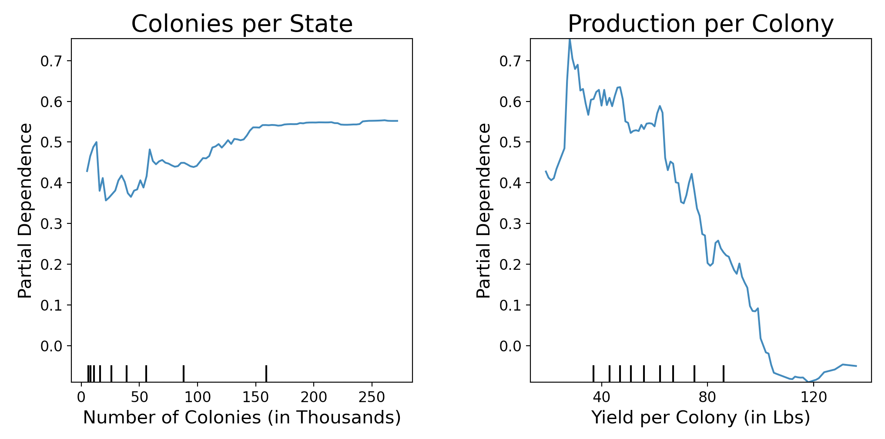
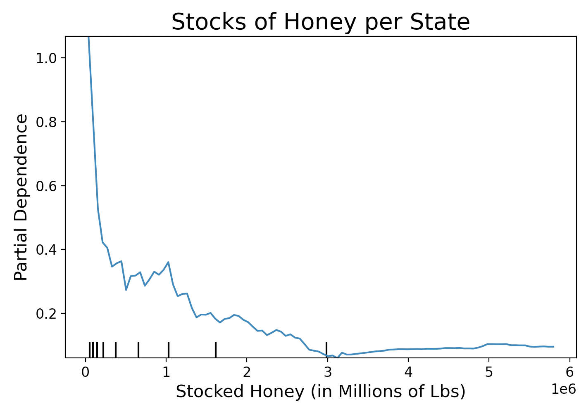

# CCD and the Recovery of American Bees

## Overview
Colony Collapse Disorder, or CCD, is a phenomenon where the majority of the worker bees in a colony will suddenly disappear. This disappearance is incredibly damaging for the hive and the vast majority do not survive. While many reports suggest that CCD has afflicted hives for well over a century (there are reports matching the description back to 1869) it has only come into the public eye in the last 20 or so years. This is mainly due to much higher observed rates in the 1990's through the mid 2000's leading up to the actual classification and naming of the disorder in 2006. To this day the actual cause of CCD is unknown, there are several theories but no concrete facts beyond its existence and devastating effects.

Bees of course play in incredibly vital role in wild ecosystems as pollinators. We additionally rely on domestic hives to pollinate our crops and produce honey. So when CCD flared up and was officially classified many people sounded the alarm so to speak. Major efforts were instituted by the EPA to track and study both domestic and wild colony health. Thankfully over time the rate of CCD appeared to slow, many reports have even stated that the American Honey industry is recovering, leading to the following questions.

## Questions
- How have domestic bee populations responded after the uptick in CCD?
- If they are recovering to what extent can we see that?

## The Data
The focus on domestic bee colonies in the questions above is due to the nature of the data we are working with. While domestic honey producers have to register their operations with the USDA wild colonies obviously don't and as such the only complete data we have is for domestic colonies.

Data was sourced at first from a [kaggle dataset](https://www.kaggle.com/jessicali9530/honey-production) for 1998-2012. I was hoping to extend this dataset to the present so I tracked down the original source, the [Annual Honey Report](https://usda.library.cornell.edu/concern/publications/hd76s004z?locale=en) published every spring by the NASS (National Agricultural Statistics Service). From there I took the corresponding tables as seen below and developed a script to automate the cleaning process.

Once cleaned the data was merged with the kaggle dataset and a new complete csv was written, it can be found in this repository's data directory.

In terms of quality the data is wonderful, all listed states in the report have values for every field so nan values were not an issue. Furthermore I was able to simply keep all the columns present as they covered exactly the information I was looking for. That said several states we not present in every year's report. Whichever states were omitted were bundled into a single field in order to not disclose data for individual operations. That said even the sum of these states was small and as such I omitted them from my study in order to ensure consistent data for all years from 1998-2019.

## Visualizing Bee Populations
Our first question of how bee populations have responded in the wake of CCD is an easy one to dive into. A great place to start is in looking at our national average across our time span of 1998 - 2020.

Now right off the bat I for one was surprised at this rate of loss in 2004-2008. While it's clear to see I was expecting something a lot more drastic based on what I knew about CCD. While this dip does represent a loss of tens of thousands of hives I expected more severity. As for the recovery of colonies it appears that we have not only returned to but surpassed colony levels from before CCD. But this is afterall an average, so maybe the picture will be clearer if we break it down by state.

Looking at these a few things caught my attention. Firstly while there does seem to be a definite increase in hives it doesn't appear that dramatic. Secondly there seems to be no change in North Dakota, South Dakota, and California. In fact they seem to have had plentiful hives even at the lowest point nationally in the past 21 years. I was curious how their numbers looked compared to the national trend.

And we can immediately see that they are outliers to put it mildly. At its lowest point South Dakota still had roughly 3 times as many colonies as the national average. While good news on whole, knowing that CCD hasn't been more than a speed bump to the growth in ND and SD and only a slight contributor to the general decline in CA, these incredibly high numbers are going to pose a challenge in trying to see if the rest of the country has recovered.

## Hypothesis Testing
Well our first step, as always with hypothesis testing, is to come up with some hypotheses. In particular our null and alternative:

<b>H0: &mu; of 2008 = &mu; of 2019 
HA: &mu; of 2008 < &mu; of 2019</b>

To quickly summarize we're starting with a null hypothesis that the mean of our current population is actually the same as it was in 2008, at our lowest point in the dataset. Our alternative is that our current population average is actually higher. Our next two steps before we actually start doing math are settling on a test and selecting an alpha value. Since we're testing whether two samples are drawn from the same population or not the obvious answer is a [Student's t-test](https://en.wikipedia.org/wiki/Student%27s_t-test) which was developed for this exact purpose. As for our alpha, how certain we want to be that they are in fact different, we'll go for the standard value of .05.

The final consideration before running our test is whether we want to include ND, CA, and SD for the reasons discussed earlier. Since they represent such outliers both in terms of size and behavior we are discounting them for the moment. When we run our test using `scipy.stats.ttest_ind()` and feed in our samples from 2008 and 2019 the results are less than exciting to put it plainly. We arrive at a p-value of .40, very much above our threshold of rejection. As such we've failed to reject our null hypothesis and we can't say that there's statistical evidence that bee populations have substantively recovered since 2008.

## Inferential Modeling
Branching away from the population dynamics of american colonies and the question of significant recovery, or not, from CCD there are other questions to be asked of this data. One of the first of concern to me, especially in the light of CCD die offs is what steps can be taken to maintain the health of the honey industry itself. While there are many hobby apiarists it's safe to say that the majority of domestic hives in the country are operated for the purpose of commercial honey production. Ensuring that these hives are maintained and propogated requires their caretaking to be profitable. To that end I used inferential modeling to try and ascertain the factors that most influence the health of that market and the profitability of domestic honey production.

Before diving into the resutls and take-aways from this modeling we should first cover the steps taken and features examined. Modeling was undertaken with use of a Random Forest Regressor as implemented by the SKLearn package. In terms of feature engineering Number of Colonies, Yield per Colony, and Stocks of Honey were used to predict Price per Unit on a state by state and year by year basis. Total production by state and total value of production by state were not examined as they're derived from these variables and give less actionable results for individual apiarists and apiary groups. Price per Unit was chosen as the target in the hopes that it could capture useful information for honey producers regardless of size. By ensuring a healthy price per unit both smaller and larger producers should hopefully be able to maintain profit margins.

Looking first at our two features related to actual honey production we can see two clear trends. Firstly price per unit tends to increase as the number of colonies increases. Secondly the price per unit seems to peak when the yields per colony are on the lower side of our spectrum. Unfortunately inferential modeling doesn't give us more than these trends so it's impossible, especially for myself with limited domain knowledge, to understand why this might be. Regardless of the actual reasons behind it though the information can be acted upon. Additionally pursuing higher colony counts per state sounds wonderful in increasing the population and protecting against CCD.

I seperated the depedence of stocked honey out for two reasons. Firstly it's not directly related to the production of honey and colony management. And secondly I have hesitations about the potential advice it gives. As we can see it suggests that higher honey prices by unit can be achieved by minimizing stores of honey on a state by state basis. While this makes sense in terms of some basic supply and demand theories it's a troubling thing to advise. Seeing as these stocks can bolster flagging production in off years eliminating them could endanger the overall health of the domestic industry. In an off year external sources could gain a larger portion of the market and potentially threaten the livelihood of domestic apiaries moving forward.
## Conclusion and Further Steps
So where does this leave us? While it seems like the population is recovering when we look at the population trends we can't confirm that through hypothesis testing. So what good is a hunch without proof? How much longer do I have to lose sleep thinking about the threat that CCD poses to bee colonies?

Well as it turns out even though we can't reject our null hypothesis currently I'm fairly hopeful about recovery being true. Whenever testing a hypothesis over time it's important to view the p-values of many points in time. The latest date may be the most immediately interesting but in order to really be confident that a change has happened you have to protect yourself from fluke years. For instance if bees had one fantastic year and their population skyrocketed you could get a p-value under .05, but if that population falls right back down the next year that's no kind of real recovery. As such the key is to look at the trend of p-values, if real recovery is occuring they'll start trending towards 0, just like it's suggested in the graph below.

 

While we don't have that many data points yet it does seem like a trend is emerging. So while it may not be time to open a bottle of champagne just yet, it looks like that day is on the way. We just have to wait and see where further data leads us.

Of course in the meantime there are steps that can be taken to not only bolster domestic colony numbers to create buffers against CCD but to ensure the health of the domestic honey industry. Even just the baseline inferential modeling shown above can point to a path of maintaining domestic production and the profits required to continue.

While we wait for that data, however, there is plenty of other things to dig into. A main point of interest moving forward will be bringing in another report the NASS releases yearly which has information on rates of colony survivorship through winter. With that data it may be possible to see how much of this population behavior is due to lower rates of CCD and how much is due to more aggressive beekeeping strategies of propgating colonies.

## Citations
I would like to close out with just one more mention on the source of this data, and to thank the curators of both these sources for their work and diligence.

1998 - 2012 https://www.kaggle.com/jessicali9530/honey-production

2013 - 2019 https://usda.library.cornell.edu/concern/publications/hd76s004z?locale=en