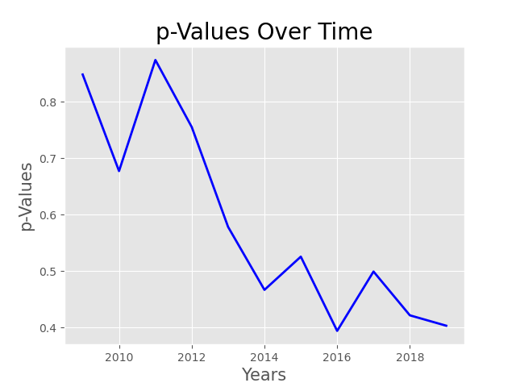

# CCD and the Recovery of American Bees

## Overview
Colony Collapse Disorder, or CCD, is a phenomenon where the majority of the worker bees in a colony will suddenly disappear. This disappearance is incredibly damaging for the hive and the grand majority do not survive. While many reports suggest that CCD has afflicted hives for well over a century (there are reports matching the description back to 1869) it has only come into the public eye in the last 20 or so years. This is mainly due to much higher observed rates in the 1990's through the mid 2000's leading up to the actual classification and naming of the disorder in 2006. To this day the actual cause of CCD is unknown, there are several theories but no concrete facts beyond its existence and devastating effects.

Bees of course play in incredibly vital role in their ecosystems as pollinators. We additionally rely on domestic hives to pollinate our crops and produce honey. So when CCD flared up and was officially classified many people sounded the alarm so to speak. Major efforts were instituted by the EPA to track and study both domestic and wild colony health. Thankfully over time the rate of CCD appeared to slow, many reports have even stated that the American Honey industry is recovering, leading to the following questions.

## Questions
- How have domestic bee populations responded after the uptick in CCD?
- If they are recovering to what extent can we see that?
- More than just the colonies, how has the honey industry been effecting in the wake of this colony die-off?

## The Data
The focus on domestic bee colonies in the questions above is due to the nature of the data we are working with. While domestic honey producers have to register their operations with the USDA wild colonies obviously don't and as such the only complete data we have is for domestic colonies.

Data was sourced at first from a [kaggle dataset](https://www.kaggle.com/jessicali9530/honey-production) for 1998-2012. I was hoping to extend this dataset to the present so I tracked down the original source, the [Annual Honey Report](https://usda.library.cornell.edu/concern/publications/hd76s004z?locale=en) published every spring by the NASS (National Agricultural Statistics Service). From there I took the corresponding tables as seen below and developed a script to automate the cleaning process.

Once cleaned the data was merged with the kaggle dataset and a new complete csv was written, it can be found in this repositories data directory.

In terms of quality the data is wonderful, all listed states in the report have values for every field so nan values were not an issue. Furthermore I was able to simply keep all the columns present as they covered exactly the information I was looking for. That said several states we not present in every year's report. Whichever states were omitted were bundled into a single field in order to not disclose data for individual operations. That said even the sum of these states was small and as such I omitted them from my study in order to ensure consistent data for all years from 1998-2019.

## Visualizing Bee Populations
Our first question of how bee populations have responded in the wake of CCD is an easy one to dive into. A great place to start is in looking at our national average across our time span of 1998 - 2020.

Now right off the bat I for one was surprised at this rate of loss in 2004-2008. While it's clear to see I was expecting something a lot more drastic based on what I knew about CCD. While this dip does represent a loss of tens of thousands of hives I expected more severity. As for the recovery of colonies it appears that we have not only returned to but surpassed colony levels from before CCD. But this is afterall an average, so maybe the picture will be clearer if we break it down by state.

Looking at these a few things caught my attention. Firstly while there does seem to be a definite increase in hives it doesn't appear that dramatic. Secondly there seems to be no change in North Dakota, South Dakota, and California. In fact they seem to have had plentiful hives even at the lowest point nationally in the past 21 years. I was curious how their numbers looked compared to the national trend.

And we can immediately see that they are outliers to put it mildly. At the lowest point in South Dakota's hit still had roughly 3 times as many colonies as the national average. While good news on whole, knowing that CCD hasn't been more than a speed bump to the growth in ND and SD and only a slight contributor to the general decline in CA, these incredibly high numbers are going to pose a challenge in trying to see if the rest of the country has recovered.

## Hypothesis Testing
Well our first step, as always with hypothesis testing, is to come up with some hypotheses. In particular our null and alternative:

<b>H0: Our current &mu; = Our lowest &mu;  
HA: Our current &mu; > Our lowest &mu; </b>

To quickly summarize we're starting with a null hypothesis that the average of our current population is actually the same as it was in 2008, at our lowest point in the dataset. Our alternative is that our current population average is actually higher. In our final step before collecting data we'll select an alpha value of .05, mainly because it's good standard and I want to feel confident in the result.

Now in order to test this we'll need to find estimations of the population average for 2008 and 2019 as well as the variance of that estimation in 2008. Since we're working with essentially a single sample for each year with a sample size of 39 we'll have to rely on [bootstrapping](https://en.wikipedia.org/wiki/Bootstrapping_%28statistics%29) for those estimations. Our final consideration before doing that analysis though has to be the outliers we discovered earlier. Seeing as they are so distant from the mean, and also represent states that barely felt the effects of CCD we're going to be discounting them to focus on the recovery of the rest of the country.

 

The exact process can be found in src/hypothesis_testing.py but in short 10*6 resamples were taken from each 2008 and 2019 and means were compared leading to a p-Value of .08. While close this doesn't reach the threshold we set and as such we can't reject our null hypothesis.

## The Honey Industry
Run through visualizations of honey production metrics, show the strong correlation between price and total value and the non-existent correlation elsewhere. Look into honey industry reports for some kind of explanation or elaboration.

## Conclusion
Overall hopeful outlook even without a nice p-value (maybe a graph of p values from 09 onward showing a trend?) Maybe highlight how insane ND is.

 

## Sources and acknowledgements
Self-explanatory